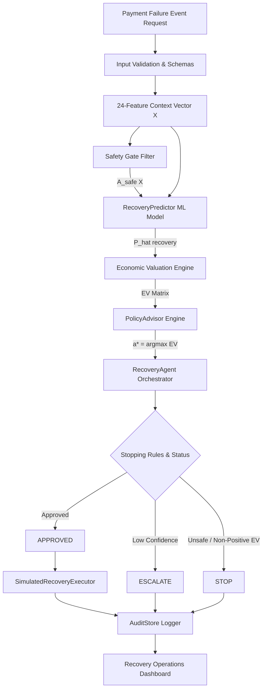

# O1 — Payment Failure Economic Recovery Advisor

> **Post-payment-failure economic decision service selecting safety-constrained interventions to maximize net expected economic value.**

[](https://razorpay.com)
[](#scientific-integrity--data-tier-disclosure)
[](#safety-model--the-8421-ablation-finding)
[](#evaluation-results)

---

## Why This Problem Matters

Payment failures do not all deserve the same recovery action. A naive retry may recover revenue on a transient network glitch, but on an expired card or bank outage, a retry wastes another attempt, increases gateway penalty fees, frustrates the customer, and risks account blocking.

> **The correct question is NOT simply "Can we recover this payment?" but "Which recovery intervention maximizes expected economic value while remaining safe and bounded?"**

O1 treats revenue recovery as an **economic optimization problem under hard domain safety constraints**.

---

## What We Built

O1 is a **post-payment-failure economic decision agent**. It does NOT perform real-time routing, fraud detection, or autonomous money movement. Instead, given a failed payment episode context $X$, O1 evaluates 5 bounded actions:

1. `retry_now` — Immediate dispatch for transient network glitches
2. `retry_later` — Scheduled retry during optimal issuer availability window
3. `switch_method` — Prompt customer to switch payment instrument
4. `update_information` — Prompt customer for card expiry/CVV update
5. `do_nothing` — Safe termination to prevent fee accumulation and friction

---

## How O1 Works

O1 runs a 5-step decision loop:

```text
Payment Failure Event
        │
        ▼
1. DETECT Context Features (24 pre-decision variables)
        │
        ▼
2. PREDICT Recovery Probability P(recovery | X, a)
        │
        ▼
3. VALUE Net Expected Economic Value EV(a | X)
        │
        ▼
4. CONSTRAIN Safe Actions A_safe(X) via Safety Gate
        │
        ▼
5. DECIDE Bounded Action a* = argmax EV(a | X) over A_safe(X)
        │
        ├─────────────────────────┐
        ▼                         ▼
   APPROVED / STOP / ESCALATE   AUDIT RECORD
```

---

## System Architecture



---

## Core Economic Valuation Model

Net Expected Economic Value is calculated as:

$$EV(a \mid X) = \hat{P}(\text{recovery} \mid X, a) \cdot V - C(a) - D(a) - F(a)$$

where:
- $V$: Order Transaction Value (INR)
- $\hat{P}(\text{recovery} \mid X, a)$: Calibrated recovery probability estimate
- $C(a)$: Direct action dispatch cost
- $D(a)$: Downside retry penalty
- $F(a)$: Customer friction cost

---

## Safety Model & The 84.21% Ablation Finding

Safety constraints are enforced **before** economic optimization:

$$a^* = \arg\max_{a \in A_{\text{safe}}(X)} EV(a \mid X)$$

### Crucial Research Finding: Safety as an Architectural Constraint
In our Task 12 ablation study, removing the Safety Gate (Ablation A3) caused an **84.21% safety violation rate** (12,632 illegal action attempts out of 15,000 test episodes). Unconstrained ML models attempt to prompt users for information updates during complete bank downtime because the transaction value is high.

With O1's Safety Gate, safety violations remain **0.00% across all operations**.

---

## Evaluation Results

Evaluated on 15,000 synthetic test payment failure episodes using Self-Normalized Importance Sampling (SNIPS) counterfactual off-policy evaluation and ground-truth oracle theoretical benchmarks:

| Metric | Result | Description / Notes |
| :--- | :---: | :--- |
| **Model Predictive ROC AUC** | `0.8532` | Calibrated `HistGradientBoostingClassifier` |
| **Model Brier Score** | `0.1516` | High probability estimation accuracy |
| **Baseline SNIPS EV** | `₹1,546.59` | Deterministic decline-code policy |
| **O1 Economic Policy EV** | `₹2,425.91` | SNIPS off-policy propensity evaluation |
| **SNIPS Net Economic Uplift** | **`+56.8%`** | **`+₹879.32 / event` net value gain** |
| **Oracle Theoretical Best EV** | `₹2,350.67` | Theoretical maximum oracle policy |
| **Oracle Policy Regret** | `₹0.94` | 99.96% of theoretical maximum oracle value |
| **Safety Violation Rate** | **`0.00%`** | Full O1 Architecture with Safety Gate |
| **Without Safety Gate** | `84.21%` | Ablation A3 (Unconstrained EV maximization) |

*Notice: All results derived from synthetic evaluation environment.*

---

## Robustness & Sensitivity Matrix

Task 12 evaluated O1 across 6 economic parameter perturbations and 3 distribution shifts:

| Perturbation / Shift | Baseline EV | O1 Policy EV | Oracle Best EV | Net Uplift | Stability |
| :--- | :---: | :---: | :---: | :---: | :---: |
| **Baseline Scenario** | ₹1,668.04 | **₹2,349.72** | ₹2,350.67 | +₹681.68 | **STABLE** |
| **High Retry Cost (2.5x)** | ₹1,659.54 | **₹2,343.83** | ₹2,344.82 | +₹684.29 | **STABLE** |
| **High Friction (2.0x)** | ₹1,656.32 | **₹2,345.92** | ₹2,347.01 | +₹689.60 | **STABLE** |
| **3.0x Amount Shift** | ₹5,004.12 | **₹7,057.89** | ₹7,060.75 | +₹2,053.77 | **STABLE** |

---

## Recovery Operations Dashboard

The React 18 + TypeScript 5 + Vite 5 frontend console provides:
1. **Overview**: Executive pitch summary, SNIPS EV uplift, and 0% vs 84.21% safety ablation visual chart.
2. **Payment Queue**: Interactive synthetic failure episodes table with filters.
3. **Decision Inspector**: Real-time `POST /decide` and `POST /execute` testing with evidence rationale.
4. **Audit Trail**: Searchable immutable decision record lookup (`GET /audit/{id}`).
5. **Evaluation**: Comprehensive off-policy SNIPS and Oracle benchmark charts.

---

## Quick Start

### 1. Requirements & Dependencies
- Python 3.11+
- Node.js v18+ / v22+
- Dependencies listed in `requirements.txt` and `frontend/package.json`

### 2. Start FastAPI Backend Service
```bash
# From repository root
uvicorn src.api.app:app --reload --port 8000
```

### 3. Start Operations Dashboard
```bash
# From frontend directory
cd frontend
npm install
npm run dev
```
Open `http://localhost:5173` in your browser.

---

## Demo Walkthrough

Run the command-line demo script:

```bash
python scripts/demo_agent.py
```

For full reviewer pitch instructions, refer to [`docs/DEMO.md`](file:///c:/Users/admin/Documents/Razorpay/docs/DEMO.md) and [`docs/PITCH_5_MINUTES.md`](file:///c:/Users/admin/Documents/Razorpay/docs/PITCH_5_MINUTES.md).

---

## Scientific Integrity & Data Tier Disclosure

> [!IMPORTANT]
> **TIER C DISCLOSURE**: This project is developed under **TIER C — Public structural data + synthetic recovery environment**. Public Razorpay documentation informed the failure taxonomy and payment schema. All recovery probabilities, action outcomes, and economic values are generated and evaluated within a synthetic environment. No production Razorpay customer data was used, and the executor is a simulation.

---

## Limitations

1. **Synthetic Environment**: Recovery outcomes are synthetic simulations designed to prevent circular evaluation.
2. **Modeled Cost Parameters**: Action costs and friction penalties are parameter model assumptions.
3. **Simulated Execution**: The executor does not perform real-world payment gateway money movement.
4. **In-Memory Store**: Audit records are persisted in a thread-safe in-memory store suitable for prototypes.

---

## Future Work

1. Production historical recovery logging integration.
2. Doubly Robust Off-Policy Evaluation (DR-OPE).
3. Real-time issuer health signals and dynamic retry scheduling.
4. Merchant-specific economic risk policies.

---

## Repository Structure

```text
Razorpay/
├── README.md                          # Main project documentation
├── requirements.txt                   # Python dependencies
├── TASK_14_E2E_VALIDATION.md          # End-to-end validation report
├── TASK_15_SUBMISSION_PACKAGE.md      # Final Buildathon submission report
├── configs/                           # Configuration YAMLs
│   ├── synthetic_config.yaml
│   └── robustness_config.yaml
├── data/                              # Synthetic datasets & checksums
├── docs/                              # Architecture, Demo, Pitch & Slide docs
│   ├── architecture.md
│   ├── DEMO.md
│   ├── PITCH_5_MINUTES.md
│   └── PITCH_SLIDES.md
├── frontend/                          # React + TypeScript + Vite Dashboard
├── reports/                           # Evaluation JSON reports & figures
├── scripts/                           # Demo and execution runners
├── src/                               # Core Python source code
│   ├── agent/                         # Bounded RecoveryAgent, Executor, AuditStore
│   ├── api/                           # FastAPI service app & schemas
│   ├── data/                          # Failure taxonomy, Safety Gate, Economics
│   ├── evaluation/                    # Off-policy IPS engine & Task 12 robustness
│   ├── models/                        # RecoveryPredictor & preprocessing
│   └── policy/                        # PolicyAdvisor & Baseline policy
└── tests/                             # 53 unit tests across 8 test suites
```
