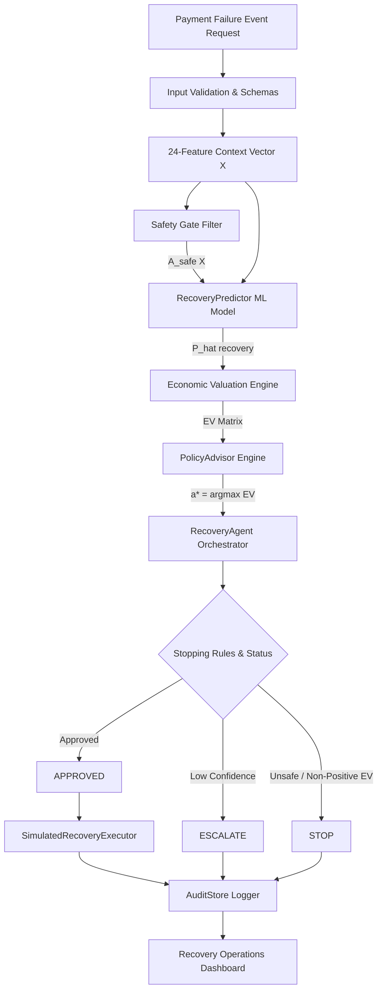

# O1 — Payment Failure Economic Recovery Advisor

> **Post-payment-failure economic decision service selecting safety-constrained interventions to maximize net expected economic value.**

[](https://razorpay.com)
[](#scientific-integrity--data-tier-disclosure)
[](#safety-model--the-ablation-finding)
[](#evaluation-results)

---

## Why This Problem Matters

Payment failures do not all deserve the same recovery action. A naive retry may recover revenue on a transient network glitch, but on an expired card or bank outage, a retry wastes another attempt, increases gateway penalty fees, frustrates the customer, and risks account blocking.

> **The correct question is NOT simply "Can we recover this payment?" but "Which recovery intervention maximizes expected economic value while remaining safe and bounded?"**

O1 treats revenue recovery as an **economic optimization problem under hard domain safety constraints**.

---

## What We Built

O1 is a **post-payment-failure economic decision agent**. It does NOT perform real-time routing, fraud detection, or autonomous money movement. Instead, given a failed payment episode context $X$, O1 evaluates 5 bounded actions:

1. `retry_now` — Immediate dispatch for transient network glitches
2. `retry_later` — Scheduled retry during optimal issuer availability window
3. `switch_method` — Prompt customer to switch payment instrument
4. `update_information` — Prompt customer for card expiry/CVV update
5. `do_nothing` — Safe termination to prevent fee accumulation and friction

---

## How O1 Works

O1 runs a 5-step decision loop:

```text
Payment Failure Event
        │
        ▼
1. DETECT Context Features (24 pre-decision variables)
        │
        ▼
2. PREDICT Recovery Probability P(recovery | X, a)
        │
        ▼
3. VALUE Net Expected Economic Value EV(a | X)
        │
        ▼
4. CONSTRAIN Safe Actions A_safe(X) via Safety Gate
        │
        ▼
5. DECIDE Bounded Action a* = argmax EV(a | X) over A_safe(X)
        │
        ├─────────────────────────┐
        ▼                         ▼
   APPROVED / STOP / ESCALATE   AUDIT RECORD
```

---

## System Architecture



---

## Core Economic Valuation Model

Net Expected Economic Value is calculated as:

$$EV(a \mid X) = \hat{P}(\text{recovery} \mid X, a) \cdot V - C(a) - D(a) - F(a)$$

where:
- $V$: Order Transaction Value (INR)
- $\hat{P}(\text{recovery} \mid X, a)$: Calibrated recovery probability estimate
- $C(a)$: Direct action dispatch cost
- $D(a)$: Downside retry penalty
- $F(a)$: Customer friction cost

---

## Safety Model & The Ablation Finding

Safety constraints are enforced **before** economic optimization:

$$a^* = \arg\max_{a \in A_{\text{safe}}(X)} EV(a \mid X)$$

The gate is **default-deny**: an action is permitted only if a rule explicitly permits it for a *recognized* failure category. Any category outside the 13-entry taxonomy - including case variants, whitespace-padded values and novel strings - collapses the action set to `do_nothing`, and the API rejects such values with HTTP 422 before they reach the model.

### Research finding: safety as an architectural constraint that costs value

In our Task 12 ablation study, removing the Safety Gate (Ablation A3) breaches the action constraints on **83.23% of episodes** (12,485 of 15,000).

The mechanism is **action-space extrapolation**, not model malice. `update_information` is only ever *logged* in the contexts where the gate permits it (expired card / invalid information), so the model learns a strong association for it and over-generalizes to contexts where that action-context pair was never observed. This is a positivity violation.

Scored honestly on the **full** population, the unconstrained variant reaches ₹2,454.54/event against the gated architecture's ₹2,353.54 - so in this synthetic environment **the Safety Gate costs roughly ₹101/event of expected value**. It is a compliance boundary we impose, not a free optimization: the modelled ₹5.00 misalignment penalty is far too small to justify it on economics alone. We report this rather than presenting the gate as costless.

With the Safety Gate active, safety violations are **0.00%** across the 15,000-episode synthetic test set.

---

## Evaluation Results

Evaluated on the 15,000-episode held-out synthetic test split. Two evaluations are reported and they answer different questions - the distinction matters:

- **Direct ground-truth simulator (authoritative).** Scores the policy against the hidden simulator on *every* episode. No matched subset, no importance weights, no estimator variance. This is the headline benchmark.
- **SNIPS off-policy estimator (deployment analogue).** Estimates policy value only from logged episodes where O1 happens to agree with the historical policy, reweighted by `1/e(a|X)`. It is what a real deployment would have to rely on before running an experiment, so we report it - but it uses a fraction of the data and carries wide uncertainty.

### Model quality

| Metric | Value | Split |
| :--- | :---: | :--- |
| **ROC AUC** | `0.8600` | **Held-out test** (headline) |
| **Brier Score** | `0.1485` | **Held-out test** (headline) |
| Mean calibration error | `0.0085` | Held-out test |
| ROC AUC / Brier | `0.8584` / `0.1494` | Validation - used to *select* the model, so optimistically biased |

Selected model: sigmoid-calibrated `HistGradientBoostingClassifier`, chosen on validation Brier among 6 candidates.

### Policy economics - direct ground-truth simulator (authoritative)

| Metric | Result | Notes |
| :--- | :---: | :--- |
| Episodes scored | `15,000 / 15,000` | None dropped |
| Deterministic baseline EV | `₹1,671.74` | Decline-code rules |
| **O1 economic policy EV** | **`₹2,353.54`** | Safety-constrained EV maximization |
| Oracle best achievable EV | `₹2,356.66` | `max` over the safe set with true probabilities |
| **Net uplift over baseline** | **`+₹681.80 / event` (+40.78%)** | Full population |
| **Regret vs oracle** | **`₹3.12 / event`** | 99.87% of the oracle ceiling |
| Per-event dominance violations | `0` | `EV_true(O1) <= EV_true(oracle)` holds on every episode |
| Action matches oracle-best | `96.85%` | |
| Safety violation rate | **`0.00%`** | Full architecture |
| Without Safety Gate (A3) | `83.23%` | Ablation - see above |

### Policy economics - SNIPS off-policy estimator

| Metric | Result | Notes |
| :--- | :---: | :--- |
| Logged epsilon-greedy policy realized EV | `₹1,596.19` | epsilon = 0.30 |
| Baseline SNIPS EV | `₹1,676.60` | 95% CI `₹1,567.68 - ₹1,785.87`, coverage 72.71% |
| O1 SNIPS EV | `₹2,415.74` | 95% CI `₹2,088.89 - ₹2,861.67`, coverage 37.80% |
| Effective sample size | `1,724.6` | 11.5% of N - the reason the interval is wide |
| Min logging propensity / max weight | `0.075` / `13.33` | Overlap holds; no clipping needed or applied |
| SNIPS minus direct true EV | `+₹62.20` | **Estimator variance, not additional recovered value** |

The SNIPS point estimate sits above the direct value by well under one standard error (`±₹201.53`). That gap is sampling noise from an 11.5%-ESS estimator on heavy-tailed rewards - it is not evidence of extra value, and we do not report it as uplift.

> [!NOTE]
> **SNIPS Off-Policy Estimator Disclosure**: SNIPS is an off-policy estimator rather than an upper bound; in the current synthetic evaluation its estimate (₹2,415.74/event) exceeds the direct oracle benchmark (₹2,356.66/event) by ₹59.08, within approximately 0.29 standard errors, consistent with estimator variance under limited effective sample size. The direct ground-truth simulator is the authoritative economic result. These results are evaluated within a synthetic environment and do not represent production performance.

*All results are from a synthetic evaluation environment. See [Scientific Integrity & Data Tier Disclosure](#scientific-integrity--data-tier-disclosure).*

---

## Robustness & Sensitivity Matrix

Task 12 re-scores the **frozen** policy across 6 economic perturbations, 3 ground-truth interaction scalings and 4 distribution shifts. In every scenario the ground truth is recomputed for the perturbed world, so the policy is never scored against the truth of a different environment. Values below are read from [`reports/task12_robustness.json`](reports/task12_robustness.json).

| Scenario | Baseline EV | O1 Policy EV | Oracle Best EV | Net Uplift | Regret | Ranking |
| :--- | :---: | :---: | :---: | :---: | :---: | :---: |
| **Economic - baseline** | ₹1,671.74 | **₹2,353.54** | ₹2,356.66 | +₹681.80 | ₹3.12 | STABLE |
| Economic - low value (0.5x) | ₹841.64 | **₹1,128.78** | ₹1,130.52 | +₹287.14 | ₹1.74 | STABLE |
| Economic - high value (2.0x) | ₹3,301.58 | **₹4,903.38** | ₹4,912.34 | +₹1,601.80 | ₹8.96 | STABLE |
| Economic - high retry cost (2.0x) | ₹1,668.94 | **₹2,349.04** | ₹2,352.20 | +₹680.10 | ₹3.15 | STABLE |
| Economic - high friction (2.0x) | ₹1,667.54 | **₹2,343.83** | ₹2,347.09 | +₹676.29 | ₹3.26 | STABLE |
| Economic - high downside (2.0x) | ₹1,670.71 | **₹2,353.54** | ₹2,356.66 | +₹682.83 | ₹3.12 | STABLE |
| **Ground truth - weaker interactions (0.5x)** | ₹1,565.17 | **₹2,066.47** | ₹2,069.58 | +₹501.30 | ₹3.12 | STABLE |
| **Ground truth - stronger interactions (1.5x)** | ₹1,678.18 | **₹2,481.09** | ₹2,483.44 | +₹802.91 | ₹2.35 | STABLE |
| **Shift - transaction value 3.0x** | ₹4,914.61 | **₹7,516.64** | ₹7,521.71 | +₹2,602.03 | ₹5.08 | STABLE |
| **Shift - failure mix (60% soft decline)** | ₹1,626.02 | **₹2,657.82** | ₹2,659.05 | +₹1,031.80 | ₹1.23 | STABLE |
| **Shift - payment mix (70% UPI)** | ₹1,659.93 | **₹2,359.09** | ₹2,362.06 | +₹699.17 | ₹2.96 | STABLE |
| **Shift - combined** | ₹3,894.14 | **₹6,859.09** | ₹6,861.53 | +₹2,964.94 | ₹2.45 | STABLE |

"Ranking" reports whether `Oracle >= O1 >= Baseline` actually held in that scenario - it is
computed, not asserted.

**On safety violations in this table.** Every scenario above constrains the policy to
`evaluate_safety_gate(context)` evaluated on the *perturbed* context, and each reports zero
violations against that specification. This is a statement about the safety-gated policy under
perturbation; it is not a claim that the system is violation-free in general. Two separate
results say otherwise and are reported as they stand: the deliberately unconstrained ablation
(A3) breaches the action constraints on 83.23% of episodes, and before Task 16D the
distribution-shift scenarios measured violations against a stale pre-shift safe set, which hid
1,277 real breaches under `SHIFT_FAILURE_MIX` (see `TASK_16D_SAFETY_ROBUSTNESS_CORRECTION.md`).

**Ground-truth robustness** is the sharpest test here: it weakens or strengthens the hidden contextual interactions the model was trained to exploit, without retraining. O1's advantage shrinks when the structure it learned is halved (+₹501.30 vs +₹681.80) and grows when it is amplified - the policy tracks the environment rather than depending on one exact simulator parameterization.

---

## Recovery Operations Dashboard

The React 18 + TypeScript 5 + Vite 5 frontend console provides:
1. **Overview**: Executive summary, net EV uplift, and the safety-gate ablation comparison - all read live from `GET /reports/summary`.
2. **Payment Queue**: Interactive synthetic failure episodes table with filters.
3. **Decision Inspector**: Real-time `POST /decide` and `POST /execute` testing with evidence rationale.
4. **Audit Trail**: Searchable immutable decision record lookup (`GET /audit/{id}`).
5. **Evaluation**: Direct ground-truth benchmark, SNIPS estimator with confidence intervals, ablation and robustness matrix - rendered from the generated evaluation artifacts, never from hardcoded constants.

---

## Quick Start

### 1. Requirements & Dependencies
- Python 3.11+
- Node.js v18+ / v22+
- Dependencies listed in `requirements.txt` and `frontend/package.json`

### 2. Generate the dataset and train the model

The dataset and the serialized model are **not** committed (see `.gitignore`); they are regenerated
deterministically. Both steps are required before the API, demo or tests will run.

```bash
# From repository root - deterministic (seed 42), verified against data/synthetic/checksums.json
python src/data/generate_synthetic.py --config configs/synthetic_config.yaml --events 100000 --outdir data/synthetic
python scripts/train_recovery_model.py

# Optional: regenerate the evaluation artifacts the dashboard reads
python scripts/evaluate_policy.py
python scripts/run_robustness.py
```

### 3. Start FastAPI Backend Service
```bash
uvicorn src.api.app:app --reload --port 8000
```

### 4. Start Operations Dashboard
```bash
# From frontend directory
cd frontend
npm install
npm run dev
```
Open `http://localhost:5173` in your browser.

---

## Demo Walkthrough

Run the command-line demo script:

```bash
python scripts/demo_agent.py
```

For full reviewer pitch instructions, refer to [`docs/DEMO.md`](file:///c:/Users/admin/Documents/Razorpay/docs/DEMO.md) and [`docs/PITCH_5_MINUTES.md`](file:///c:/Users/admin/Documents/Razorpay/docs/PITCH_5_MINUTES.md).

---

## Scientific Integrity & Data Tier Disclosure

> [!IMPORTANT]
> **TIER C DISCLOSURE**: This project is developed under **TIER C — Public structural data + synthetic recovery environment**. Public Razorpay documentation informed the failure taxonomy and payment schema. All recovery probabilities, action outcomes, and economic values are generated and evaluated within a synthetic environment. No production Razorpay customer data was used, and the executor is a simulation.

---

## Limitations

1. **Synthetic Environment**: Recovery outcomes are synthetic simulations designed to prevent circular evaluation. Nothing here is a measurement of Razorpay production performance.
2. **Modeled Cost Parameters**: Action costs and friction penalties are parameter model assumptions, not observed fee contracts.
3. **Simulated Execution**: The executor does not perform real-world payment gateway money movement.
4. **In-Memory Store**: Audit records live in a thread-safe in-memory store suitable for prototypes; they do not survive a restart.
5. **The baseline is close to the data-generating policy.** The deterministic baseline agrees with the historical logging heuristic on ~88% of episodes, and the simulator's hidden interactions were designed to be invisible to that heuristic. Beating it shows the pipeline recovers known structure; it is not evidence of an edge over a real production policy.
6. **Near-oracle efficiency is partly structural.** Every hidden interaction is a deterministic function of features the model already receives, so there is no unobserved confounding and no irreducible heterogeneity. A well-specified learner should approach the oracle here; 99.87% efficiency characterizes the environment as much as the method.
7. **The "temporal" split carries no temporal structure.** Timestamps are drawn i.i.d. and then sorted, so the chronological split is statistically equivalent to a random one. It does not test drift.
8. **No authentication.** The API has no authN/authZ and is not deployable as-is. The executor binds decisions to payments and rejects replays, but that is decision integrity, not access control.
9. **SNIPS is imprecise at this coverage.** ESS is 11.5% of N and the 95% interval spans roughly ±₹390. It corroborates the direct benchmark; it cannot carry a headline on its own.

---

## Future Work

1. Production historical recovery logging integration.
2. Doubly Robust Off-Policy Evaluation (DR-OPE).
3. Real-time issuer health signals and dynamic retry scheduling.
4. Merchant-specific economic risk policies.

---

## Repository Structure

```text
Razorpay/
├── README.md                          # Main project documentation
├── requirements.txt                   # Python dependencies
├── TASK_14_E2E_VALIDATION.md          # End-to-end validation report
├── TASK_15_SUBMISSION_PACKAGE.md      # Final Buildathon submission report
├── configs/                           # Configuration YAMLs
│   ├── synthetic_config.yaml
│   └── robustness_config.yaml
├── data/                              # Synthetic datasets & checksums
├── docs/                              # Architecture, Demo, Pitch & Slide docs
│   ├── architecture.md
│   ├── DEMO.md
│   ├── PITCH_5_MINUTES.md
│   └── PITCH_SLIDES.md
├── frontend/                          # React + TypeScript + Vite Dashboard
├── reports/                           # Evaluation JSON reports & figures
├── scripts/                           # Demo and execution runners
├── src/                               # Core Python source code
│   ├── agent/                         # Bounded RecoveryAgent, Executor, AuditStore
│   ├── api/                           # FastAPI service app & schemas
│   ├── data/                          # Failure taxonomy, Safety Gate, Economics
│   ├── evaluation/                    # Off-policy IPS engine & Task 12 robustness
│   ├── models/                        # RecoveryPredictor & preprocessing
│   └── policy/                        # PolicyAdvisor & Baseline policy
├── requirements-lock.txt              # Exact verified dependency versions
└── tests/                             # 83 unit tests across 9 test suites
```
