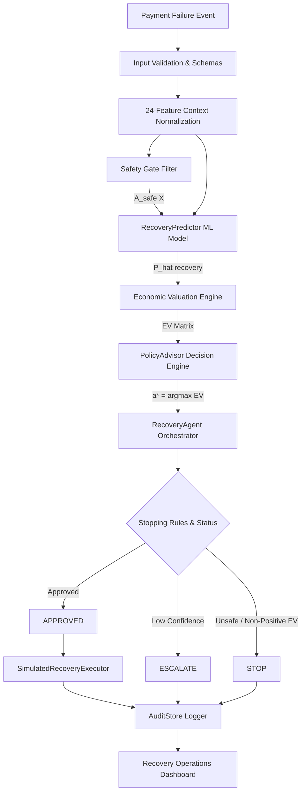

# Payment Recovery Technical Architecture & System Layering

> **Built for Razorpay AI Buildathon 2026 — Track 03: AI Revenue Recovery**
> **Project**: Payment Recovery

---

## 1. End-to-End System Workflow

---

## 2. Layer-by-Layer Architectural Specification

### 1. Data & Context Ingestion Layer (`src/data/`)
- **Public Schema Taxonomy**: Modeled after Razorpay public failure documentation (`network_timeout`, `soft_decline`, `authentication_failure`, `insufficient_funds`, `expired_card`).
- **24-Feature Vector**: Context vector $X$ comprises 10 numeric features (amount, customer tenure, historical success rate, attempt count, time since last success, hour, day of week, etc.) and 14 categorical features (currency, product category, payment method, issuer category, failure code, merchant segment, corridor, etc.).

### 2. Safety Gate Compliance Layer (`src/data/safety.py`)
- **Domain Constraints**: Hard deterministic rules filtering illegal or counterproductive actions prior to economic optimization, establishing $A_{\text{safe}}(X) \subseteq A$.
- **Key Safety Rules**:
  - `EXCLUDE_UPDATE_INFO_ON_TECHNICAL_FAILURES`: Excludes `update_information` during network timeouts or bank downtime.
  - `CAP_RETRY_COUNT`: Enforces a hard stop when `retry_count_before_event >= 3`.
  - `EXCLUDE_CARD_ACTIONS_FOR_UPI`: Excludes card-specific updates for UPI payment instruments.

### 3. Predictive Recovery Estimator Layer (`src/models/`)
- **Machine Learning Architecture**: `HistGradientBoostingClassifier` trained with `CalibratedClassifierCV` (Isotonic regression) to output true calibrated recovery probabilities $\hat{P}(\text{recovery} \mid X, a) \in [0, 1]$.
- **Anti-Leakage Isolation**: Trained strictly on 24 pre-decision context features. Outcome fields (`recovered`, `recovery_timestamp`, `time_to_recovery_hours`) and oracle ground-truth fields are strictly isolated.

### 4. Economic Valuation Layer (`src/data/economics.py`)
- **Net Expected Value Formula**:
  $$EV(a \mid X) = \hat{P}(\text{recovery} \mid X, a) \cdot V - C(a) - D(a) - F(a)$$
  where $V$ is transaction amount in INR, $C(a)$ is direct action cost, $D(a)$ is downside retry penalty, and $F(a)$ is customer friction cost.

### 5. Policy Decision Layer (`src/policy/`)
- **Authoritative Optimization**: `PolicyAdvisor` evaluates all candidate safe actions $a \in A_{\text{safe}}(X)$ and selects:
  $$a^* = \arg\max_{a \in A_{\text{safe}}(X)} EV(a \mid X)$$

### 6. Bounded Recovery Agent Layer (`src/agent/recovery_agent.py`)
- **Decision Lifecycle Orchestration**:
  - Enforces explicit stopping rules (`MAX_ATTEMPTS_EXCEEDED`, `UNSAFE_ACTION`, `NON_POSITIVE_EV`).
  - Evaluates confidence margins to set status (`APPROVED`, `ESCALATE`, `STOP`).
  - Generates deterministic, evidence-based explanations referencing probabilities and net EV in INR without LLM non-determinism.

### 7. Simulated Execution Layer (`src/agent/executor.py`)
- **Safety Lock & Action Dispatch**: `SimulatedRecoveryExecutor` validates that requested actions match approved decisions, belong to $A_{\text{safe}}(X)$, and have status `APPROVED`.
- **Simulation Disclaimer**: Simulates action execution without calling real Razorpay or gateway payment APIs.

### 8. Audit Store & Operations Dashboard (`src/agent/audit.py` & `frontend/`)
- **Thread-Safe Audit Store**: In-memory store saving complete decision context, candidate evaluation matrix, safety rules, evidence rationale, and execution status.
- **Operations Console**: React 18 + TypeScript 5 + Vite 5 dashboard providing real-time decision inspection, audit log lookup, and off-policy SNIPS evaluation metrics.
